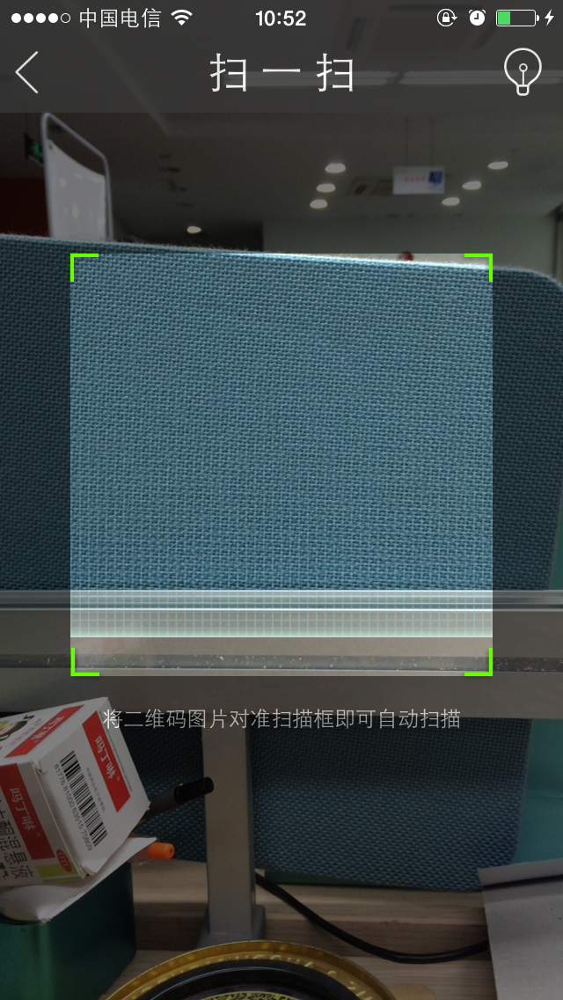

# cordova-plugin-barcode
# Barcode Scanner a pluggin for Cordova

This plugin implements barcode scanner on Cordova 4.0

## Supported Cordova Platforms

* Android 4.0.0 or above
* iOS 7.0.0 or above



## Use Tips

cordova plugin add [dir]

## JS
``` js
com.jieweifu.plugins.barcode.startScan(function(success){
    alert(JSON.stringify(success));
}, function(error){
    alert(JSON.stringify(error));
});
```
